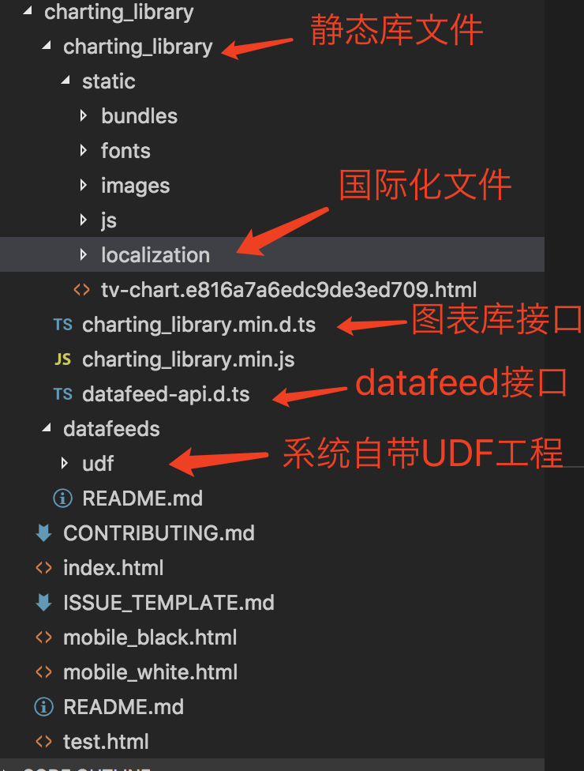

## 初识TradingView图表库

---

TradingView图表库官方名称： Charting Library

### 图表库申请

图表库的使用必须得到授权。

申请地址： https://cn.tradingview.com/HTML5-stock-forex-bitcoin-charting-library/

申请后一般2、3天会通过，然后需要在TradingView官方人员发来的PDF协议书上签字。

> 图表库不提供源码（只提供模糊处理后的代码），并且不允许私自修改里面的内容。

### 图表库使用与入门

许可申请后便可访问以下私有资源：
https://github.com/tradingview/charting_library

图表库在线demo地址：http://demo_chart.tradingview.com/
> 其实在线demo就是上面私有资源放到tradingview自己的http服务器上

下载后的图表内容：

### http-server
https://www.npmjs.com/package/http-server

组件一览：
http://tradingview.gitee.io/featuresets/
